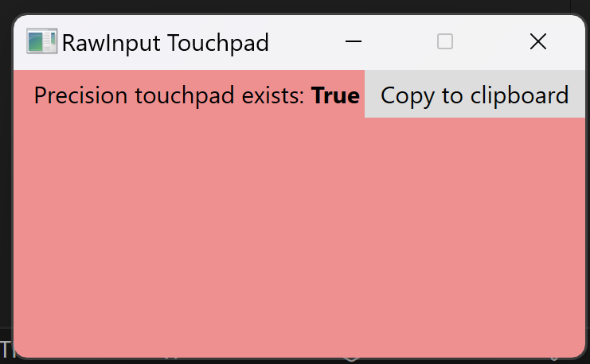
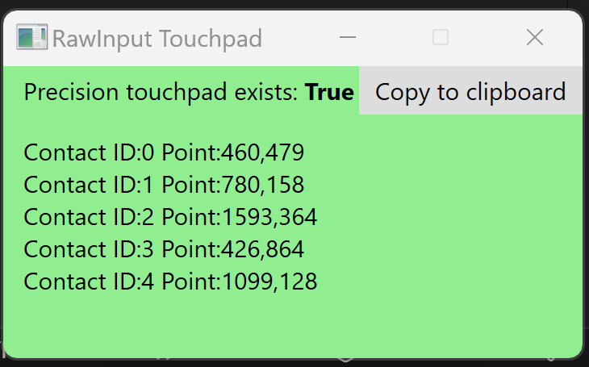
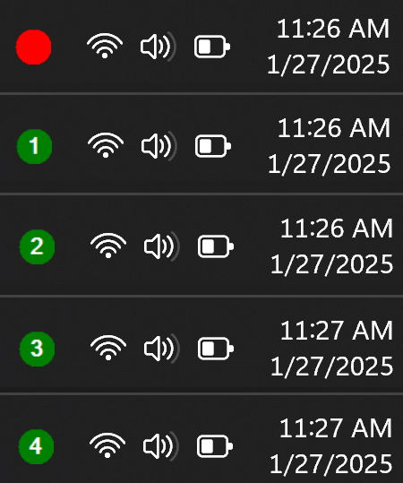

# RawInput Touchpad

Sample to capture inputs from Precision Touchpad by [Raw Input](https://docs.microsoft.com/en-us/windows/win32/inputdev/raw-input) API. This is C# implementation which basically follows C++ function of [TouchpadGestures Advanced][1] by @kamektx to parse inputs from Touchpad including each contact point. Also, [RawInput.Sharp][2] by @mfakane is well sophisticated C# implementation and great help to understand this API. Many thanks!

- [kamektx/TouchpadGestures_Advanced][1]
- [mfakane/rawinput-sharp][2]

## Requirements

- .NET 9.0

Originally built on .NET 5.0, and upgraded in 2025, but no changes were needed. So, it should easily run on older versions of .NET

## Examples

When there are no fingers touching the touchpad, the window turns red

When five fingers are touching the touchpad of Surface Pro 4 Type Cover, five contacts appear with each coordinates, and the window turns green

When minimized the program shows up as a circle icon in the tray which is red when no touch is detected. When touch is detected it turns green and shows the number of touches.

## License

- MIT License

[1]: https://github.com/kamektx/TouchpadGestures_Advanced
[2]: https://github.com/mfakane/rawinput-sharp